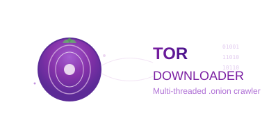

# Tor Downloader Rust - Descargador Multi-hilo de Sitios .onion

<div align="center">
  


*Un descargador recursivo multi-hilo para sitios .onion con soporte completo para Tor, interfaz TUI opcional y capacidades de monitoreo en tiempo real.*

---

</div>

## 📋 Prerequisitos

### 1. Rust
```bash
# Instalar Rust usando rustup
curl --proto '=https' --tlsv1.2 -sSf https://sh.rustup.rs | sh
source ~/.cargo/env

# En Windows, descargar desde: https://rustup.rs/
```

### 2. Tor
#### Windows (con Chocolatey):
```powershell
choco install tor
```

#### Linux (Ubuntu/Debian):
```bash
sudo apt update
sudo apt install tor
```

#### macOS (con Homebrew):
```bash
brew install tor
```

## 🚀 Instalación Rápida

1. **Clonar y compilar:**
```bash
git clone <tu-repo>
cd sitiojulian
git checkout rust
cargo build --release
```

2. **Configurar Tor:**
```bash
# El archivo torrc_windows ya está incluido para Windows
# Para Linux/macOS, usar configuración estándar de Tor
```

3. **Ejecutar:**
```bash
# Iniciar Tor (en otra terminal)
tor -f torrc_windows  # Windows
# O simplemente: tor  # Linux/macOS

# Ejecutar el descargador
./target/release/tor-downloader-rs [OPCIONES] <URL>
```

## 🛠️ Uso

### Comandos Básicos

```bash
# Descarga básica
cargo run -- http://example.onion

# Con múltiples workers (8 hilos)
cargo run -- -j 8 http://example.onion

# Con profundidad específica
cargo run -- -d 3 http://example.onion

# Con interfaz TUI
cargo run -- --tui http://example.onion

# Con delays personalizados (500ms entre requests)
cargo run -- -D 500 http://example.onion

# Modo verbose
cargo run -- -v http://example.onion
```

### Opciones Disponibles

| Opción | Descripción | Valor por defecto |
|--------|-------------|-------------------|
| `-j, --workers` | Número de workers paralelos | 4 |
| `-d, --depth` | Profundidad máxima de crawling | 2 |
| `-D, --delay` | Delay entre requests (ms) | 1000 |
| `--tui` | Activar interfaz TUI | false |
| `-v, --verbose` | Modo verbose | false |
| `-o, --output` | Directorio de salida | ./downloaded_site |

### Ejemplo Completo

```bash
# Configuración recomendada para sitios grandes
cargo run --release -- \
  --workers 6 \
  --depth 3 \
  --delay 800 \
  --tui \
  --output ./mi_descarga \
  http://kxlpsf4uua2k36quvcob3mjlguurbc3rhjkwt7thoyi52o7y6tf2wrad.onion
```

## 🔧 Configuración de Tor

### Windows
El proyecto incluye `torrc_windows` preconfigurado:
```bash
tor -f torrc_windows
```

### Linux/macOS
Configuración estándar en `/etc/tor/torrc` o usar:
```
SOCKSPort 9050
ControlPort 9051
DataDirectory ./tor-data
```

## 📊 Interfaz TUI

La interfaz TUI muestra:
- ✅ URLs procesadas en tiempo real
- 📈 Estadísticas de descarga
- 🚀 Progreso por worker
- 📁 Estructura de archivos descargados
- ⚠️ Errores y warnings

**Controles TUI:**
- `q` - Salir
- `↑/↓` - Navegar logs
- `Tab` - Cambiar entre paneles

## 🧪 Testing y Desarrollo

```bash
# Tests unitarios
cargo test

# Tests con logs
cargo test -- --nocapture

# Benchmarks
cargo bench

# Verificar código
cargo clippy

# Formatear código
cargo fmt
```

## 📁 Estructura del Proyecto

```
src/
├── main.rs          # Punto de entrada
├── lib.rs           # Librería principal
├── config.rs        # Configuración
├── crawler.rs       # Lógica de crawling
├── downloader.rs    # Descarga de archivos
├── parser.rs        # Parsing HTML
├── tui.rs           # Interfaz terminal
├── monitor.rs       # Monitoreo
└── errors.rs        # Manejo de errores
```

## 🚨 Troubleshooting

### Error: "Can't complete SOCKS5 connection"
```bash
# Verificar que Tor esté corriendo
netstat -tlnp | grep 9050  # Linux
netstat -an | findstr 9050  # Windows

# Reiniciar Tor
pkill tor && tor -f torrc_windows
```

### Error: "Permission denied"
```bash
# En Windows, ejecutar como administrador
# En Linux, verificar permisos del directorio de datos
chmod 700 ./tor-data
```

### Sitio .onion no responde
- Verificar que la URL sea correcta
- Algunos sitios .onion tienen tiempo de actividad limitado
- Intentar con diferentes sitios conocidos

## 🤝 Contribuir

1. Fork el proyecto
2. Crear rama feature: `git checkout -b feature/nueva-funcionalidad`
3. Commit: `git commit -am 'Agregar nueva funcionalidad'`
4. Push: `git push origin feature/nueva-funcionalidad`
5. Crear Pull Request

## 📜 Licencia

MIT License - ver archivo LICENSE para detalles.

## ⚠️ Disclaimer

Este software es solo para propósitos educativos y de investigación. Úsalo responsablemente y cumple con las leyes locales. Los autores no se responsabilizan por el uso indebido. 